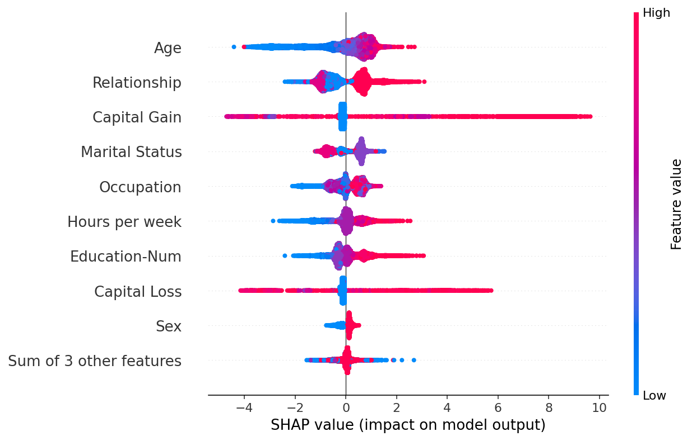

> [XAI (Explainable AI)](#xai-explainable-ai)
- [SHAP](#shap)
- [LIME](#lime)
- [Shapash](#shapash)
- [ELI5](#eli5)
- [InterpretML](#interpretml)
- [OmniXAI](#omnixai)


# XAI (Explainable AI)
> Açıklanabilir AI (XAI), çözümün sonuçlarının insan uzmanlar tarafından anlaşılabilmesi için yapay zeka teknolojisinin (AI) uygulanmasındaki yöntem ve teknikleri ifade eder. Yapay zekanın neden belirli bir karara vardığını tasarımcılarının bile açıklayamadığı makine öğrenimindeki "kara kutu" kavramıyla çelişir.

2 açıklanabilirlik yöntemi:

- Modele özgü (içsel): Modele özgü yorumlanabilirlik yöntemleri, belirli model sınıflarıyla sınırlıdır. İçsel yöntemler, tanımı gereği modele özgüdür.
- Modelden bağımsız (post-hoc): Modelden bağımsız yöntemler, belirli bir makine öğrenimi modeline bağlı değildir. Modelden bağımsız yorumlar genellikle post-hoc'tur.

2 tür yorumlama:

- Yerel: Belirli bir tahminin nasıl ve neden yapıldığını açıklayın
- Global: Bir modelin genel olarak nasıl çalıştığını açıklayın
Modelinizin ortalama olarak neyi önemsediği ve bunların sonucu nasıl etkilediği

### SHAP
> SHAP (SHapley Additive ExPlanations), herhangi bir makine öğrenimi modelinin çıktısını açıklamaya yönelik oyun kuramsal bir yaklaşımdır. Oyun teorisindeki klasik Shapley değerlerini ve bunların ilgili uzantılarını kullanan yerel açıklamalarla optimum kredi tahsisini birleştirir (ayrıntılar ve alıntılar için belgelere bakın).

##### Örnek

[Go to documentation >](https://shap-lrjball.readthedocs.io/en/latest/example_notebooks/plots/beeswarm.html)
> This notebook is designed to demonstrate (and so document) how to use the shap.plots.beeswarm function. It uses an XGBoost model trained on the classic UCI adult income dataset (which is a classification task to predict if people made over \$50k in the 1990s).
>> The beeswarm plot is designed to display an information-dense summary of how the top features in a dataset impact the model’s output. Each instance the given explanation is represented by a single dot on each feature fow. The x position of the dot is determined by the SHAP value (shap_values.value[instance,feature]) of that feature, and dots “pile up” along each feature row to show density. Color is used to display the original value of a feature (shap_values.data[instance,feature]). In the plot below we can see that Age is the most important feature on average, and than young (blue) people are less likely to make over \$50k.



```bash
!pip install shap
!pip install xgboost
```


> shap.plots.beeswarm
```py
import xgboost
import shap

# train XGBoost model
X,y = shap.datasets.adult()
model = xgboost.XGBClassifier().fit(X, y)

# compute SHAP values
explainer = shap.Explainer(model, X)
shap_values = explainer(X)
```

```PY 
shap.plots.beeswarm(shap_values)

```


### LIME
[Example](https://towardsdatascience.com/lime-how-to-interpret-machine-learning-models-with-python-94b0e7e4432e)

### Shapash
[Docs](https://github.com/MAIF/shapash)
### ELI5
> ELI5, makine öğrenimi sınıflandırıcılarında hata ayıklamaya ve tahminlerini açıklamaya yardımcı olan bir Python paketidir.

>> - "Beyaz kutu" modelleri için görselleştirmeler sağlar (basit modeller: lojistik regresyon, vb...)
>>    - Yerel ve küresel yorumlama

>> - "Kara kutu" modelleri için Permütasyon Önemi sağlar (rastgele orman, artırma, vb...)
>>    - Sadece küresel yorumlama

##### Örnek 
[Go to exxample](https://www.analyticsvidhya.com/blog/2020/11/demystifying-model-interpretation-using-eli5/)

### InterpretML
[Docs](https://github.com/interpretml/interpret)

### OmniXAI
[Docs](https://github.com/salesforce/OmniXAI)
